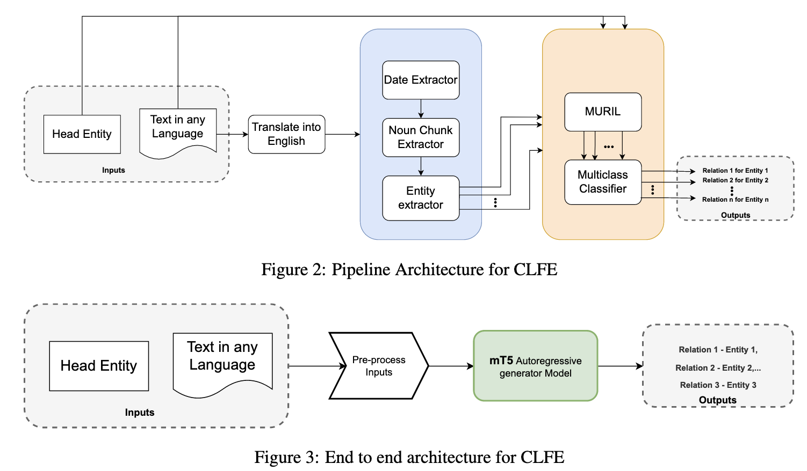

# Massively Multilingual Language Models for Cross Lingual Fact Extraction from Low Resource Indian Languages

This repository contains the source code for the paper: Massively Multilingual Language Models for Cross Lingual Fact Extraction from Low Resource Indian Languages, ICON 2022.


## Overview 

In this work, we propose the creation of cross-lingual fact extraction 

We explored two different unsupervised methods to solve cross-lingual alignment task based on: 

- Classification base two phase pipeline
- End-to-end Generative Approach




This repository consists of steps for executing the cross-lingual fact extraction approaches 


## Requirements 
This repo was tested on Python 3.7. The main requirements are: 
- torch==1.7.1
- pytorch-lightning==1.0.8
- indic-nlp-library==0.81
- sacrebleu==2.0.0
- sacremoses==0.0.43
- transformers==4.9.2
- tqdm==4.48.2
- wandb==0.12.4
- urduhack==1.1.1
- unidecode==1.2.0
- sentencepiece==0.1.91
- light-the-torch==0.3.5


## Installation
Install the required packgaes as follow:
```
pip install -r requirements.txt
```
For preprocessing IndicTrans needs to be installed and setup. Please follow these instructions for setup.
[IndicTrans installation guidelines](https://colab.research.google.com/github/AI4Bharat/indicTrans/blob/main/indicTrans_python_interface.ipynb#scrollTo=E_4JxNdRlPQB)

## Dataset 

### Gold standard Test dataset

| Language | #Count | #Word count (avg/min/max) | #Facts/sentence (avg/min/max)
| --- | --- | --- | --- |
|Hindi|842|11.1/5/24|2.1/1/5
Marathi|736|12.7/6/40|2.1/1/8
Telugu|734|9.7/5/30|2.2/1/6
Tamil|656|9.5/5/24|1.9/1/8
English|470|17.5/8/61|2.7/1/7
Gujarati|530|12.7/6/31|2.1/1/6
Bengali|792|8.7/5/24|1.6/1/5
Kannada|642|10.4/6/45|2.2/1/7 


### Train and validation dataset (automatically aligned)

| Language | #Count | #Word Count (avg/min/max) | #Facts/sentence (avg/min/max) |
| --- | --- | --- | --- |
Hindi|56582|25.3/5/99|2.0/1/10|
Marathi|19408|20.4/5/94|2.2/1/10|
Telugu|24344|15.6/5/97|1.7/1/10|
Tamil|56707|16.7/5/97|1.8/1/10|
English|132584|20.2/4/86|2.2/1/10|
Gujarati|9031|23.4/5/99|1.8/1/10|
Bengali|121216|19.3/5/99|2.0/1/10|
Kannada|25441|19.3/5/99|1.9/1/10|


## Cross-lingual fact extraction 

To finetune the generative pipeline on the XAlign dataset, follow the steps:

```
$ cd data-to-text-generator/mT5-baseline
$ python main.py --epochs 30 --gpus 1 --batch_size 2 --src_max_seq_len 250 --tgt_max_seq_len 200 --learning_rate 1e-3 --model_name google/mt5-small --online_mode 0 --use_pretrained 1 --lang hi,mr,te,ta,en,gu,bn,kn --verbose --enable_script_unification 1 
```

To evaluate the trained model, follow the steps:
```
$ cd data-to-text-generator/mT5-baseline
$ python main.py --epochs 30 --gpus 1 --batch_size 4 --src_max_seq_len 250 --tgt_max_seq_len 200 --learning_rate 1e-3 --model_name google/mt5-small --online_mode 0 --use_pretrained 1 --lang hi,mr,te,ta,en,gu,bn,kn enable_script_unification 1 --inference
```

### Pipeline Based Model
Data needs to be setup in the root directory as follows.
1. Extract contents of the data zip file into current directory
2. Make the following directories
    ```mkdir saved_models```
    ```mkdir saved_metrics```
3. Preprocess the data
PreProcessData.ipynb run all steps in this notebook simultaneously.
4. Train the relation prediction model.
 ```
python train.py
```
5. Run evaluation
```
python extratcted_tail_prediction.py
```
6. Generate Metrics
```
python generate_metrics.py
```


